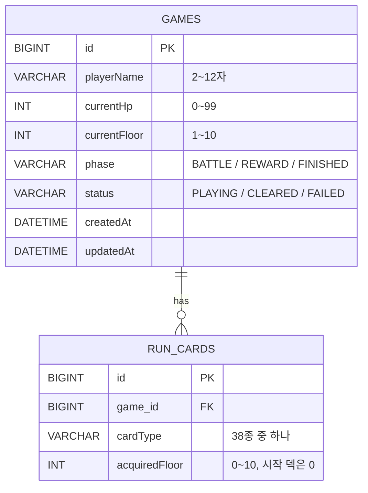
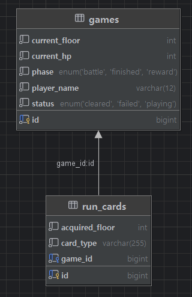

# Crimson Citadel API

로그라이크 카드 게임 "붉은 달의 성채"의 진행 상황을 저장하고 불러오는 Spring Boot 기반 REST API 서버입니다.

전체 명세: https://f-api.github.io/game-spring-api-docs/basic/api-docs.html

## ERD

`Game`과 `RunCard`는 1:N 단방향 관계입니다. `RunCard`가 `Game`을 외래키로만 참조하고, `Game`은 자식 컬렉션을 갖지 않습니다. 카드의 조회·저장·삭제는 항상 `RunCardRepository`를 통해 명시적으로 처리합니다.



- `Game.createdAt` / `updatedAt`은 `BaseEntity` + JPA Auditing(`@EnableJpaAuditing`)으로 자동 관리됩니다.
- `RunCard`는 감사(Auditing) 대상이 아니며 생성/수정 시각을 갖지 않습니다.
- `deckSize`, `createdAt`, `updatedAt`(게임 요약 기준)은 명세상 **선택 필드**입니다. 없으면 클라이언트가 해당 표시를 숨깁니다.

### 실제 스키마 (IntelliJ Database Tools)



## 한눈에 보기

| Method | URL | 성공 | 하는 일 |
|---|---|---|---|
| POST | `/games` | 201 | 게임과 시작 덱 생성 |
| GET | `/games` | 200 | 게임 요약 목록 (ID 내림차순) |
| GET | `/games/{gameId}` | 200 | 게임 상세와 전체 덱 |
| PATCH | `/games/{gameId}` | 204 | 플레이어 이름 변경 |
| PUT | `/games/{gameId}/progress` | 200 | 진행 필드와 전체 덱 저장 |
| DELETE | `/games/{gameId}` | 204 | 게임과 덱 삭제 |

## 공통: 에러 응답

실패한 요청은 상태 코드와 함께 아래 형식을 반환합니다. `message`는 사람이 읽을 수 있는 원인 설명이며, 클라이언트는 이 문자열을 화면에 그대로 표시합니다.

```json
{
  "status": 404,
  "error": "Not Found",
  "path": "/games/999",
  "message": "게임을 찾을 수 없습니다. id=999"
}
```

| 상태 | 발생 조건 |
|---|---|
| 400 | 요청 본문 형식, enum 값, 필드 제약(Bean Validation) 위반. 경로·쿼리에 숫자가 아닌 값을 보낸 경우 포함 |
| 404 | 존재하지 않는 `gameId` |
| 409 | 이미 끝난 게임(`CLEARED`/`FAILED`)에 진행 저장 시도 |

---

## 게임 생성

`POST /games`

플레이어 이름과 시작 덱으로 새 게임을 만듭니다. 덱은 요청 순서대로 저장되며, `currentHp=99`, `currentFloor=1`, `phase=REWARD`, `status=PLAYING`으로 초기화합니다.

**Request Body**

| 필드 | 타입 | 제약 |
|---|---|---|
| `playerName` | string | 2~12자, 공백만 불가 |
| `deck` | array | 비어 있으면 안 됨 |
| `deck[].cardType` | string | 공백만 불가, 값 목록은 카드 타입 참고 |
| `deck[].acquiredFloor` | integer | 0~10 (시작 덱은 0) |

```json
{
  "playerName": "밤의 후계자",
  "deck": [
    { "cardType": "STRIKE", "acquiredFloor": 0 }
  ]
}
```

**Response `201`** — `Location: /games/{id}` 헤더 포함(선택)

```json
{
  "id": 12,
  "playerName": "밤의 후계자",
  "currentHp": 99,
  "currentFloor": 1,
  "phase": "REWARD",
  "status": "PLAYING",
  "createdAt": "2026-09-03T18:20:11",
  "updatedAt": "2026-09-03T18:20:11",
  "deck": [
    { "id": 1, "cardType": "STRIKE", "acquiredFloor": 0 }
  ]
}
```

`400` 요청 본문 형식, enum 값 또는 필드 제약 위반

---

## 게임 목록 조회

`GET /games`

저장된 모든 게임을 ID 내림차순으로 반환합니다. 덱은 포함하지 않고, 카드 수(`deckSize`)만 포함합니다. 없으면 빈 배열입니다.

**Response `200`**

```json
[
  {
    "id": 12,
    "playerName": "밤의 후계자",
    "currentFloor": 4,
    "currentHp": 61,
    "phase": "BATTLE",
    "status": "PLAYING",
    "deckSize": 12,
    "createdAt": "2026-09-03T18:20:11",
    "updatedAt": "2026-09-03T19:02:45"
  }
]
```

> 구현 노트: `deckSize`는 게임 개수만큼 카드 수 쿼리를 반복 실행하지 않도록, `RunCardRepository`에서 `group by` + DTO 프로젝션(`select new`)으로 한 번에 집계합니다. 목록 조회는 게임 수와 무관하게 쿼리 2회(게임 조회 1 + 카드 수 집계 1)로 고정됩니다.

---

## 게임 상세 조회

`GET /games/{gameId}`

게임 한 건과 전체 덱(카드 ID 오름차순)을 반환합니다.

| Path Parameter | 타입 | 설명 |
|---|---|---|
| `gameId` | integer | 게임의 고유 식별자 |

**Response `200`**

```json
{
  "id": 12,
  "playerName": "밤의 후계자",
  "currentHp": 47,
  "currentFloor": 5,
  "phase": "REWARD",
  "status": "PLAYING",
  "createdAt": "2026-09-03T18:20:11",
  "updatedAt": "2026-09-03T19:02:45",
  "deck": [
    { "id": 1, "cardType": "STRIKE", "acquiredFloor": 0 }
  ]
}
```

`404` 해당 ID의 게임이 없음

---

## 플레이어 이름 변경

`PATCH /games/{gameId}`

선택한 게임의 `playerName`만 변경합니다. 다른 필드는 바뀌지 않으며, 변경 감지(더티 체킹)로 처리합니다.

**Request Body**

| 필드 | 타입 | 제약 |
|---|---|---|
| `playerName` | string | 2~12자, 공백만 불가 |

```json
{ "playerName": "붉은 순례자" }
```

`204` 변경 완료, 본문 없음
`400` 필드 제약 위반 · `404` 해당 ID의 게임이 없음

---

## 진행과 전체 덱 저장

`PUT /games/{gameId}/progress`

HP, 층, 단계, 상태와 전체 덱을 저장합니다. `deck`은 **추가할 카드가 아니라 저장할 덱 전체**입니다. 게임 필드 갱신과 덱 교체는 원자적으로 처리되며, 기존 카드는 모두 삭제 후 요청 순서대로 재저장되므로 같은 본문을 반복 전송해도 카드 수가 늘지 않습니다. 카드 ID는 교체 시 새로 발급됩니다.

**Request Body**

| 필드 | 타입 | 제약 |
|---|---|---|
| `currentHp` | integer | 0~99 |
| `currentFloor` | integer | 1~10 |
| `phase` | enum | `BATTLE` / `REWARD` / `FINISHED` |
| `status` | enum | `PLAYING` / `CLEARED` / `FAILED` |
| `deck` | array | 비어 있으면 안 됨 |

```json
{
  "currentHp": 47,
  "currentFloor": 5,
  "phase": "REWARD",
  "status": "PLAYING",
  "deck": [
    { "cardType": "STRIKE", "acquiredFloor": 0 }
  ]
}
```

**Response `200`** — 교체된 카드 ID가 담긴 게임 상세 (게임 상세 조회와 동일한 스키마)

`400` 필드 제약 위반 · `404` 해당 ID의 게임이 없음 · `409` 이미 끝난(`CLEARED`/`FAILED`) 게임에는 저장 불가

---

## 게임 삭제

`DELETE /games/{gameId}`

게임과 그에 속한 모든 카드를 삭제합니다. `RunCard`를 먼저 삭제한 뒤 `Game`을 삭제합니다.

`204` 삭제 완료, 본문 없음
`404` 해당 ID의 게임이 없음

---

## 카드 타입

`cardType`에 들어가는 값입니다. 서버는 문자열로 저장만 하고, 카드의 효과와 표시 이름은 클라이언트가 정합니다. 시작 덱은 `STRIKE` 2장, `HEART_PIERCE`, `GUARD`, `MIST_KNOT`, `QUICK_SLASH`, `WARDING_SLASH`, `BLOOD_RUNE`, `MEND`으로 총 9장입니다. 전체 38종 목록은 API 명세를 참고하세요.

## 아키텍처

Controller → Service → Repository 3계층으로 분리되어 있으며, 계층 간 데이터 전달은 Entity가 아닌 DTO로만 이루어집니다.

```
com.gamebasic
├─ game
│  ├─ controller   # GameController
│  ├─ service      # GameService
│  ├─ repository   # GameRepository
│  ├─ entity        # Game, BaseEntity, GamePhase, GameStatus
│  └─ dto           # 요청/응답 DTO
└─ runcard
   ├─ entity        # RunCard
   ├─ repository    # RunCardRepository
   └─ dto           # CardResponse, RunCardRequest
```
